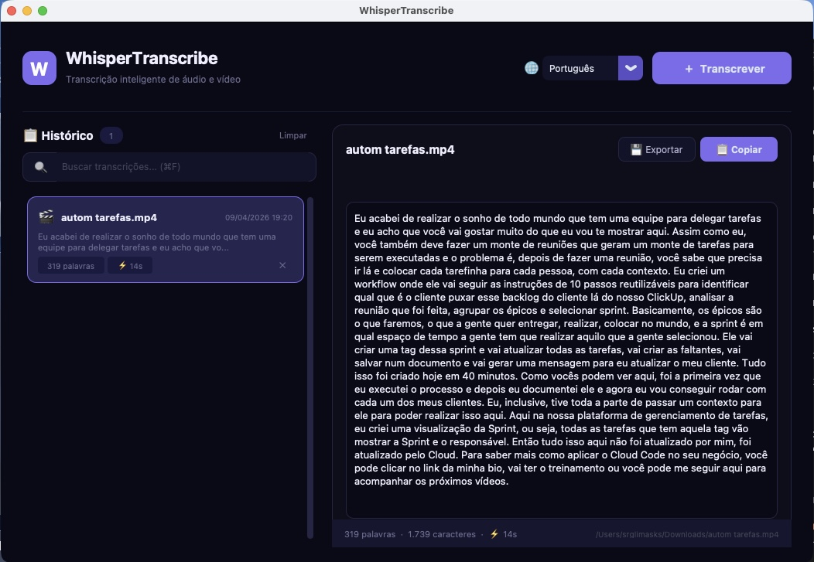

# WhisperTranscribe

**Transcreva audio e video localmente no seu Mac com IA — sem internet, sem custos, sem limites.**

WhisperTranscribe e um app nativo macOS que usa [WhisperKit](https://github.com/argmaxinc/WhisperKit) (Apple Neural Engine) para transcrever arquivos de audio e video diretamente no seu computador. Tudo roda localmente — seus dados nunca saem da sua maquina.



---

## Funcionalidades

- **Transcricao local com IA** — usa WhisperKit com Apple Neural Engine, sem enviar dados pra nuvem
- **Servidor persistente** — carrega o modelo uma vez, transcricoes rapidas em sequencia
- **Processamento em lote** — arraste 20+ arquivos de uma vez, processa em fila automatica
- **Exportacao em lote** — exporte multiplas transcricoes em .txt, .md, .srt ou .vtt
- **Legendas com timestamps** — exportacao SRT/VTT com marcacao de tempo por segmento
- **Drag & drop nativo** — arraste arquivos direto na janela do app
- **Interface premium dark** — design limpo, moderno, com tema roxo/azul
- **Multi-idioma** — Portugues, English, Espanol, Francais, Deutsch, Italiano, Japones, Chines, ou auto-detectar
- **Historico completo** — todas as transcricoes salvas com busca instantanea e lazy loading
- **Notificacao macOS** — aviso quando o processamento em lote termina
- **Copiar com um clique** — botao de copiar com feedback visual
- **Estatisticas detalhadas** — contagem de palavras, caracteres, duracao do processamento
- **Atalhos de teclado** — Cmd+O abrir, Cmd+F buscar, Cmd+E exportar
- **Suporte a 16+ formatos** — MP4, MOV, MP3, WAV, M4A, FLAC, OGG, WebM, MKV, AAC, AVI, WMA, e mais

## Requisitos

| Requisito | Detalhe |
|-----------|---------|
| **Sistema** | macOS 13 (Ventura) ou superior |
| **Chip** | Apple Silicon (M1, M2, M3, M4) recomendado. Intel funciona mas com performance menor |
| **Python** | 3.12 ou superior |
| **Homebrew** | Para instalar o WhisperKit CLI |
| **Espaco em disco** | ~500 MB (modelo Whisper + app) |

## Instalacao Rapida

### Opcao 1: Script automatico (recomendado)

```bash
git clone https://github.com/sergiolimasks/WhisperTranscribe.git
cd WhisperTranscribe
chmod +x install.sh
./install.sh
```

O script faz tudo automaticamente:
1. Verifica se e macOS com Apple Silicon
2. Instala Homebrew (se necessario)
3. Instala WhisperKit CLI via Homebrew
4. Verifica Python 3 e tkinter
5. Cria ambiente virtual e compila o .app
6. Pergunta se deseja instalar em /Applications

### Opcao 2: Instalacao manual

**1. Instale o WhisperKit CLI** (o motor de transcricao):

```bash
brew install whisperkit-cli
```

Verifique a instalacao:

```bash
whisperkit-cli --version
```

**2. Instale o Python 3 e tkinter** (se ainda nao tiver):

```bash
brew install python@3.12 python-tk@3.12
```

**3. Clone e instale as dependencias:**

```bash
git clone https://github.com/sergiolimasks/WhisperTranscribe.git
cd WhisperTranscribe

pip3 install -r requirements.txt
```

As dependencias Python sao:

| Pacote | Para que serve |
|--------|---------------|
| `customtkinter` | Interface grafica moderna (widgets, temas, etc.) |
| `pyobjc-core` | Bridge Python/Objective-C — necessario para drag & drop nativo no macOS |
| `pyobjc-framework-Cocoa` | Framework Cocoa do macOS — acesso a NSView, NSPasteboard, etc. |
| `py2app` | Empacotador de apps macOS (opcional, so para gerar o .app) |

> **Nota:** Se receber erro `externally-managed-environment`, adicione `--break-system-packages`:
> ```bash
> pip3 install --break-system-packages -r requirements.txt
> ```

**4. Execute:**

```bash
python3 app.py
```

### Opcao 3: Compilar como .app nativo

Para gerar um `WhisperTranscribe.app` clicavel:

```bash
python3 setup.py py2app
```

O app e gerado em `dist/WhisperTranscribe.app`. Para instalar:

```bash
cp -R dist/WhisperTranscribe.app /Applications/
```

Pronto! Abra pelo Launchpad, Spotlight (Cmd+Espaco), ou Finder.

## Como usar

1. **Abra o WhisperTranscribe** — o servidor WhisperKit inicia automaticamente (aguarde a barra de loading)
2. **Arraste arquivos na janela** ou clique em "+ Transcrever" para selecionar
3. **Selecione o idioma** no seletor (padrao: Portugues)
4. **Aguarde a transcricao** — a barra de progresso mostra o tempo decorrido
5. **Copie ou exporte** o texto gerado

### Processamento em lote

- Arraste 20+ arquivos de uma vez na janela
- Uma fila aparece no painel esquerdo com status de cada arquivo
- Os arquivos sao processados um por vez automaticamente
- Voce recebe uma notificacao macOS quando a fila terminar

### Exportacao em lote

- Clique em "Exportar" no cabecalho do historico
- Selecione quais transcricoes exportar (todas vem marcadas)
- Escolha o formato: `.txt`, `.md`, `.srt` ou `.vtt`
- Escolha o nome e local do arquivo
- Clique em "Exportar"

### Atalhos de teclado

| Atalho | Acao |
|--------|------|
| `Cmd + O` | Abrir arquivo(s) para transcrever |
| `Cmd + N` | Abrir arquivo(s) para transcrever |
| `Cmd + F` | Focar na busca do historico |
| `Cmd + E` | Exportar transcricao atual |
| `Esc` | Limpar busca |

### Formatos suportados

**Audio:** MP3, WAV, M4A, FLAC, AAC, OGG, OPUS, WMA, CAF

**Video:** MP4, MOV, MKV, AVI, WebM, M4V, 3GP

## Arquitetura

```
WhisperTranscribe/
├── app.py              # Aplicacao principal (UI customtkinter)
├── shared.py           # Constantes, cores e utilitarios compartilhados
├── macos_drop.py       # Drag & drop nativo via PyObjC
├── batch_queue.py      # Fila de processamento em lote (UI + logica)
├── export_modal.py     # Modal de exportacao em lote (.txt/.md/.srt/.vtt)
├── whisper_server.py   # Gerenciamento do servidor WhisperKit
├── setup.py            # Configuracao do py2app para gerar .app
├── install.sh          # Script de instalacao automatica
├── requirements.txt    # Dependencias Python
├── assets/
│   ├── icon.icns       # Icone do app
│   └── screenshot.png  # Screenshot para o README
├── LICENSE             # MIT License
└── README.md
```

**Stack:**
- **Frontend:** [customtkinter](https://github.com/TomSchimansky/CustomTkinter) — framework moderno de UI para Python
- **Backend:** [WhisperKit CLI](https://github.com/argmaxinc/WhisperKit) — transcricao nativa com Apple Neural Engine
- **Drag & Drop:** [PyObjC](https://pyobjc.readthedocs.io/) — bridge Python/Objective-C para APIs nativas macOS
- **Build:** [py2app](https://py2app.readthedocs.io/) — empacotador de apps nativos macOS

### Como funciona internamente

1. Ao abrir, o app inicia o servidor WhisperKit (`whisperkit-cli serve`) que carrega o modelo na memoria
2. Arquivos arrastados ou selecionados entram na fila de processamento (`batch_queue.py`)
3. Cada arquivo e enviado via API HTTP local para o servidor — sem recarregar o modelo a cada arquivo
4. O drag & drop usa PyObjC para injetar metodos nativos na NSView do Tk (`macos_drop.py`)
5. A transcricao e salva no historico local com timestamps por segmento (para export SRT/VTT)
6. Ao fechar o app, o servidor e encerrado automaticamente

## Onde ficam os dados

| Dado | Local |
|------|-------|
| Historico | `~/.whisper_transcribe/history.json` |
| Configuracoes | `~/.whisper_transcribe/settings.json` |
| Transcricoes TXT | Salvas ao lado do arquivo original |
| Cache do modelo | `~/Library/Caches/whisperkit-cli/` (~260 MB) |

## Troubleshooting

**"whisperkit-cli: command not found"**
```bash
brew install whisperkit-cli
```

**"No module named customtkinter" ou "No module named objc"**
```bash
pip3 install -r requirements.txt
```
Ou com flag de sistema:
```bash
pip3 install --break-system-packages -r requirements.txt
```

**"No module named tkinter"**
```bash
brew install python-tk@3.12
```

**Drag & drop nao funciona**
- O drag & drop requer `pyobjc-core` e `pyobjc-framework-Cocoa` instalados
- Verifique: `python3 -c "import objc; print('OK')"`
- Se falhar: `pip3 install pyobjc-core pyobjc-framework-Cocoa`
- Alternativa: clique na area de drop para abrir o seletor de arquivos

**Transcricao vazia ou com erros**
- Verifique se o arquivo tem audio audivel
- Tente um formato diferente (MP4 ou WAV)
- Verifique se o idioma selecionado esta correto

**App nao abre apos compilar**
- Tente rodar direto: `python3 app.py`
- Recompile: `rm -rf build dist && python3 setup.py py2app`

**Primeira execucao demora mais**
- Normal! O WhisperKit baixa o modelo na primeira execucao (~260 MB)
- As proximas execucoes serao muito mais rapidas (modelo em cache)

## Licenca

MIT License — use, modifique e distribua livremente.

## Creditos

- [WhisperKit](https://github.com/argmaxinc/WhisperKit) por Argmax — motor de transcricao
- [CustomTkinter](https://github.com/TomSchimansky/CustomTkinter) por Tom Schimansky — framework de UI
- [PyObjC](https://pyobjc.readthedocs.io/) — bridge Python/Objective-C
- [OpenAI Whisper](https://github.com/openai/whisper) — modelo de IA original

---

**Feito por [Sergio Lima](https://github.com/sergiolimasks)**
