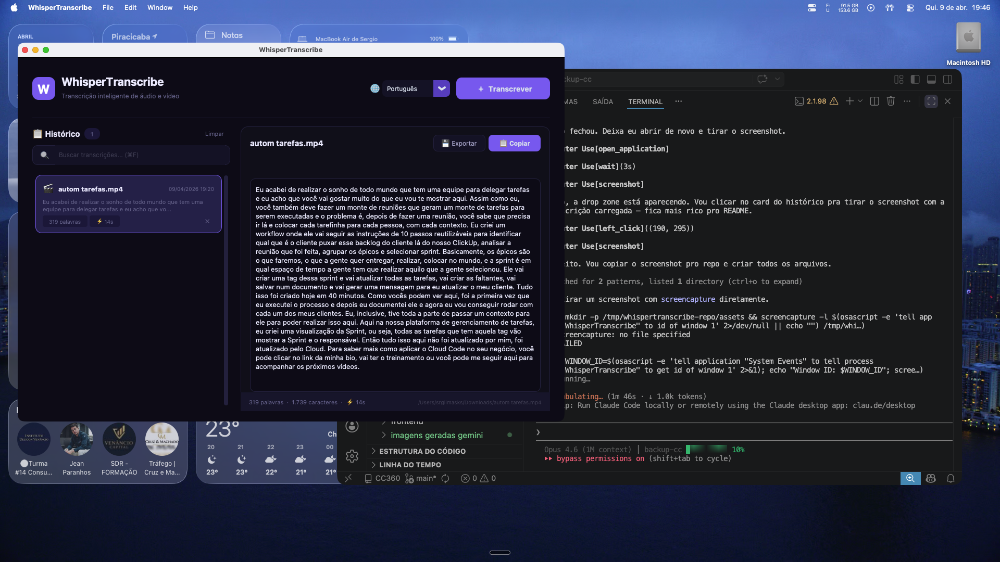

# WhisperTranscribe

**Transcreva audio e video localmente no seu Mac com IA — sem internet, sem custos, sem limites.**

WhisperTranscribe e um app nativo macOS que usa [WhisperKit](https://github.com/argmaxinc/WhisperKit) (Apple Neural Engine) para transcrever arquivos de audio e video diretamente no seu computador. Tudo roda localmente — seus dados nunca saem da sua maquina.



---

## Funcionalidades

- **Transcricao local com IA** — usa WhisperKit com Apple Neural Engine, sem enviar dados pra nuvem
- **Interface premium dark** — design limpo, moderno, com tema roxo/azul
- **Multi-idioma** — Portugues, English, Espanol, Francais, Deutsch, Italiano, Japones, Chines, ou auto-detectar
- **Historico completo** — todas as transcricoes salvas com busca instantanea
- **Exportar como TXT** — salve a transcricao onde quiser
- **Copiar com um clique** — botao de copiar com feedback visual
- **Drop zone visual** — interface intuitiva com formatos suportados
- **Estatisticas detalhadas** — contagem de palavras, caracteres, duracao do processamento
- **Atalhos de teclado** — Cmd+O abrir, Cmd+F buscar, Cmd+C copiar, Cmd+E exportar
- **Suporte a 16+ formatos** — MP4, MOV, MP3, WAV, M4A, FLAC, OGG, WebM, MKV, AAC, AVI, WMA, e mais

## Requisitos

| Requisito | Detalhe |
|-----------|---------|
| **Sistema** | macOS 13 (Ventura) ou superior |
| **Chip** | Apple Silicon (M1, M2, M3, M4) recomendado. Intel funciona mas com performance menor |
| **Python** | 3.10 ou superior |
| **Homebrew** | Para instalar o WhisperKit CLI |
| **Espaco em disco** | ~500 MB (modelo Whisper + app) |

## Instalacao Rapida

### Opcao 1: Script automatico (recomendado)

```bash
git clone https://github.com/sergiolimasks/WhisperTranscribe.git
cd WhisperTranscribe
chmod +x install.sh
./install.sh
```

O script faz tudo automaticamente:
1. Verifica se e macOS com Apple Silicon
2. Instala Homebrew (se necessario)
3. Instala WhisperKit CLI via Homebrew
4. Verifica Python 3 e tkinter
5. Cria ambiente virtual e compila o .app
6. Pergunta se deseja instalar em /Applications

### Opcao 2: Instalacao manual

**1. Instale o WhisperKit CLI** (o motor de transcricao):

```bash
brew install whisperkit-cli
```

Verifique a instalacao:

```bash
whisperkit-cli --version
```

**2. Instale o Python 3 e tkinter** (se ainda nao tiver):

```bash
brew install python@3.12 python-tk@3.12
```

**3. Clone e compile o app:**

```bash
git clone https://github.com/sergiolimasks/WhisperTranscribe.git
cd WhisperTranscribe

python3 -m venv .venv
source .venv/bin/activate

pip install customtkinter py2app
python3 setup.py py2app
```

**4. Instale o app:**

```bash
cp -R dist/WhisperTranscribe.app /Applications/
```

Pronto! Abra pelo Launchpad, Spotlight (Cmd+Espaco), ou Finder.

### Opcao 3: Rodar sem compilar

Se nao quiser compilar o .app, pode rodar direto:

```bash
git clone https://github.com/sergiolimasks/WhisperTranscribe.git
cd WhisperTranscribe

python3 -m venv .venv
source .venv/bin/activate

pip install customtkinter
python3 app.py
```

## Como usar

1. **Abra o WhisperTranscribe**
2. **Clique em "+ Transcrever"** ou arraste um arquivo na janela
3. **Selecione o idioma** no seletor (padrao: Portugues)
4. **Aguarde a transcricao** — a barra de progresso mostra o andamento
5. **Copie ou exporte** o texto gerado

### Atalhos de teclado

| Atalho | Acao |
|--------|------|
| `Cmd + O` | Abrir arquivo para transcrever |
| `Cmd + F` | Focar na busca do historico |
| `Cmd + C` | Copiar transcricao |
| `Cmd + E` | Exportar como TXT |
| `Esc` | Limpar busca |

### Formatos suportados

**Audio:** MP3, WAV, M4A, FLAC, AAC, OGG, OPUS, WMA, CAF

**Video:** MP4, MOV, MKV, AVI, WebM, M4V, 3GP

## Arquitetura

```
WhisperTranscribe
├── app.py              # Codigo principal do app (customtkinter)
├── setup.py            # Configuracao do py2app para gerar .app
├── install.sh          # Script de instalacao automatica
├── requirements.txt    # Dependencias Python
├── assets/
│   ├── icon.icns       # Icone do app
│   └── screenshot.png  # Screenshot para o README
├── LICENSE             # MIT License
└── README.md
```

**Stack:**
- **Frontend:** [customtkinter](https://github.com/TomSchimansky/CustomTkinter) — framework moderno de UI para Python
- **Backend:** [WhisperKit CLI](https://github.com/argmaxinc/WhisperKit) — transcricao nativa com Apple Neural Engine
- **Build:** [py2app](https://py2app.readthedocs.io/) — empacotador de apps nativos macOS

## Onde ficam os dados

| Dado | Local |
|------|-------|
| Historico | `~/.whisper_transcribe/history.json` |
| Configuracoes | `~/.whisper_transcribe/settings.json` |
| Transcricoes TXT | Salvas ao lado do arquivo original |

## Troubleshooting

**"whisperkit-cli: command not found"**
```bash
brew install whisperkit-cli
```

**"No module named tkinter"**
```bash
brew install python-tk@3.12
```

**Transcricao vazia ou com erros**
- Verifique se o arquivo tem audio audivel
- Tente um formato diferente (MP4 ou WAV)
- Verifique se o idioma selecionado esta correto

**App nao abre apos compilar**
- Tente rodar direto: `python3 app.py`
- Recompile: `rm -rf build dist && python3 setup.py py2app`

**Primeira transcricao demora mais**
- Normal! O WhisperKit baixa o modelo na primeira execucao (~400MB)
- As proximas transcricoes serao muito mais rapidas

## Licenca

MIT License — use, modifique e distribua livremente.

## Creditos

- [WhisperKit](https://github.com/argmaxinc/WhisperKit) por Argmax — motor de transcricao
- [CustomTkinter](https://github.com/TomSchimansky/CustomTkinter) por Tom Schimansky — framework de UI
- [OpenAI Whisper](https://github.com/openai/whisper) — modelo de IA original

---

**Feito com Claude Code por [Sergio Lima](https://github.com/sergiolimasks)**
